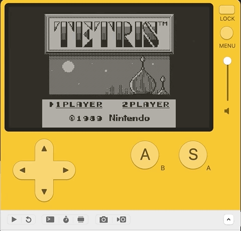

<h1 align="center">Playboy</h1>
<h6 align="right">Playdate Gameboy</h6>

Playboy is a Nintendo Gameboy emulator for the [Panic Playdate](https://play.date)!

<table>
  <tr>
    <td></td>
    <td></td>
  </tr>
</table>

## Building

Playdate isn't exactly a Tier 1 platform for Rust :)

As a result, the build is a _little_ bit trickier than usual, but you can install
Playboy by following these steps.

### Prerequisites

You'll need

- The [Playdate SDK](https://play.date/dev/) (last tested with v1.9.1)
- [Rustup](https://rustup.rs)
- Nightly Rust (run`rustup default nightly`)
- [Crank](https://github.com/rtsuk/crank), the actual tool for compiling Rust for Playdate

### Running

```bash
git clone https://github.com/adamsoutar/playboy
cd playboy
git submodule init
git submodule update
```

> Next, you'll need to place a Gameboy game in the `playboy` folder as `rom.gb`.
> The Playboy repo doesn't contain any copyrighted Nintendo software or any built-in ROMs.

```bash
cp ~/MyPersonalRomCollection/Tetris.gb ./rom.gb
```

> Now we can finally build & run the code:

```bash
crank run --release
```

This will launch the Playdate Simulator and boot right in to your favourite
Gameboy game!

## Controls

**Left**, **Right**, **Up**, **Down**, **A** and **B** are exactly what you'd
expect.

**Start** and **Select** are interesting, because the Playdate doesn't have
enough buttons!

Turn the crank clockwise to press **Start**, and counter-clockwise to press
**Select**.

## The core

Playboy is powered by my Rust Gameboy Emulator project [gbrs](https://github.com/adamsoutar/gbrs).

_If you fancy a challenge_, I'd love to see people try and port it to more systems!

For the platform-specific side of things, it uses the awesome [crankstart](https://github.com/rtsuk/crankstart) bindings by Rob Tsuk.

---

<h6 align="center">By Adam Soutar</h6>
