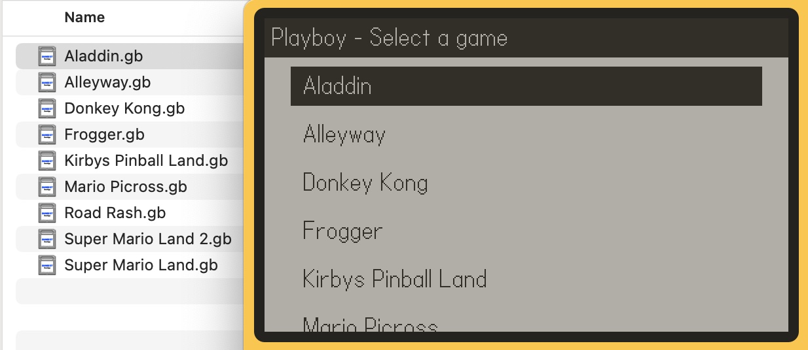

# Adding games to Playboy

(on Simulator)

## Copy games to the Data folder

In Playdate Simulator, select the "Reveal Data folder" option like so:

Now, double click on `Data`, then `me.overflo.playboy`.

> If you don't see a folder named `me.overflo.playboy` in `Data`, run Playboy at least once to create it, or just create the folder yourself

Paste your games into this folder. Make sure the files end in `.gb` - if they came
in a `.zip` file, unzip them first.

You can add as many as you like, you'll be able to pick between them.

## Naming files

Games show up in Playboy named the same as the files in the data folder.

Give your `.gb` files useful names so that you'll recognise which game they are.

---

###### Enjoy!
