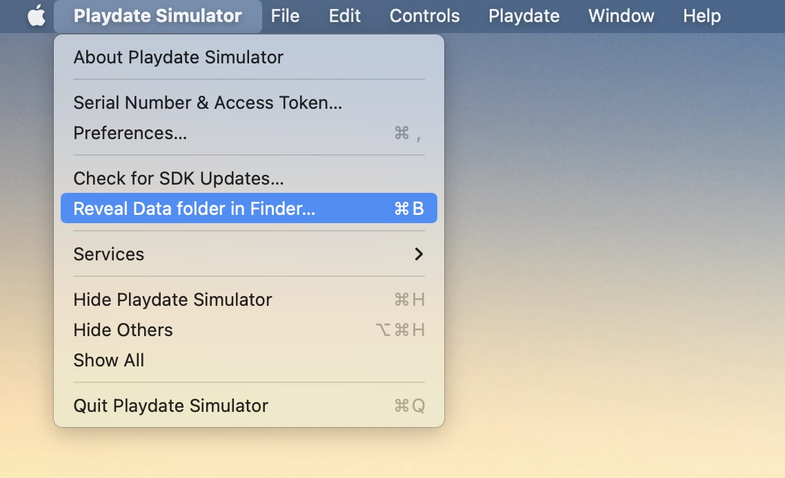

# Providing a game ROM

To play Gameboy games on your Playdate, you'll need.. Gameboy games 😄

Playboy doesn't come with any, so you will need to find your own copy of
whatever you'd like to play. They usually come in `.gb` files (eg. `TETRIS.gb`) - the way you acquire them is up to you.

## Copy the game to the Data folder

In Playdate Simulator, select the "Reveal Data folder" option like so:

Now, double click on `Data`, then `me.overflo.playboy`.

> If you don't see a folder named `me.overflo.playboy` in `Data`, run Playboy at least once to create it, or just create the folder yourself

Paste your game into this folder and make sure the file is named `rom.gb`.

## Switching games

Any time you like, you can swap out the rom file for a different game (eg.
to switch between Tetris and Super Mario Land), just re-open Playboy and it'll
boot into the new game.

---

###### Enjoy!
